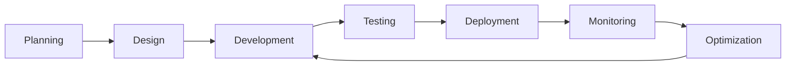

<div align="center">

# 👋 Hi, I'm Sachin Shakya


### 🚀 Crafting High-Performance Web Applications | Turning Complex Ideas into Elegant Solutions

<p align="center">
  <a href="https://www.linkedin.com/in/iamsachinshakya">
    
  </a>
  <a href="mailto:sachinshakya205001@gmail.com">
    
  </a>
  <a href="https://github.com/iamsachinshakya">
    
  </a>
</p>


</div>

---

## 🎯 About Me

```typescript
const sachin = {
    role: "Full Stack Engineer",
    location: "India 🇮🇳",
    code: ["TypeScript", "JavaScript", "HTML", "CSS", "SQL"],
    technologies: {
        frontend: ["React", "Next.js", "SvelteKit", "Redux", "React Query"],
        backend: ["Node.js", "Express", "NestJS", "Nginx"],
        databases: ["PostgreSQL", "MongoDB", "MySQL", "Redis", "DynamoDB"],
        cloud: ["AWS", "Firebase", "Vercel"],
        tools: ["Git", "GitHub Actions", "Prisma", "Docker"]
    },
    architecture: ["Microservices", "RESTful APIs", "Event-Driven", "Serverless"],
    currentFocus: "Building scalable, user-centric applications",
    funFact: "I debug with console.log and I'm not ashamed! 😄"
};
```


### 💡 What I Do

- 🔨 Build **scalable web applications** from concept to deployment
- ⚡ Optimize **performance** and enhance **user experiences**
- 🏗️ Design **robust backend architectures** and **APIs**
- 🎨 Create **intuitive, responsive** frontend interfaces
- ☁️ Deploy and manage applications on **cloud platforms**
- 🔄 Implement **CI/CD pipelines** for seamless delivery
- 📚 Continuously learning and exploring **new technologies**

<br clear="right"/>

---

## 🛠️ Tech Stack & Tools

<div align="center">

### 💻 Frontend
<p>
  
</p>

### ⚙️ Backend
<p>
  
</p>

### 🗄️ Databases & Caching
<p>
  
</p>

### ☁️ Cloud & DevOps
<p>
  
</p>

</div>

---

## 📊 GitHub Stats

<div align="center">
  
</div>

---

## 📈 Contribution Activity

<div align="center">
  


</div>

---

## 💼 Professional Highlights

<div align="center">

| 🎯 Focus Areas | 🚀 Expertise |
|:---:|:---:|
| Full Stack Development | React • Next.js • Node.js • NestJS |
| Database Design | PostgreSQL • MongoDB • Redis |
| Cloud Infrastructure | AWS • Firebase • Serverless |
| System Architecture | Microservices • RESTful APIs |
| Performance Optimization | Caching • Query Optimization |
| DevOps & CI/CD | GitHub Actions • Docker |

</div>

---

## 💭 Developer Wisdom

<div align="center">


</div>

---

## 🌟 Featured Projects

## 🌟 Featured Projects

<div align="center">

### 💼 Building Scalable Solutions & Contributing to Innovation

<table>
<tr>
<td align="center" width="33%">

#### 🚀 Web Applications
Developing high-performance, user-centric applications with modern frameworks and best practices

</td>
<td align="center" width="33%">

#### ⚡ Backend Systems
Architecting robust APIs and scalable microservices with optimal database design

</td>
<td align="center" width="33%">

#### ☁️ Cloud Solutions
Deploying and managing production-grade applications on AWS and serverless platforms

</td>
</tr>
</table>

<br/>

<!-- Top Contributed Repositories -->


<br/>
<br/>

<!-- Call to Action Buttons -->
<p>
  <a href="https://github.com/iamsachinshakya?tab=repositories">
    
  </a>
  <a href="https://github.com/iamsachinshakya?tab=repositories&q=&type=source">
    
  </a>
</p>

### 🎯 Project Highlights

<table>
<tr>
<td align="center" width="50%">

**🔥 Recent Work**
- Full Stack Web Applications
- RESTful & GraphQL APIs
- Real-time Data Processing
- Payment Integration Systems
- Authentication & Authorization

</td>
<td align="center" width="50%">

**🎨 Technical Approach**
- Clean, Maintainable Code
- Test-Driven Development
- Agile Methodologies
- Performance Optimization
- Security Best Practices

</td>
</tr>
</table>

<br/>

---

### 💡 What I Build

<p align="left" style="padding: 0 50px;">

**E-commerce Platforms** → Building complete online shopping experiences with payment gateways, inventory management, and order tracking

**SaaS Applications** → Developing subscription-based software with user management, analytics dashboards, and API integrations

**Content Management Systems** → Creating flexible CMS solutions with role-based access control and dynamic content delivery

**Real-time Applications** → Implementing WebSocket-based chat systems, live notifications, and collaborative tools

**Data Analytics Dashboards** → Visualizing complex datasets with interactive charts and real-time updates

**Mobile-Responsive Interfaces** → Crafting seamless experiences across all devices with modern design patterns

</p>

<br/>

---

### 🔨 Development Workflow

<div align="center">



</div>

<br/>

<p align="center">
  
  
  
</p>

</div>

---

## 📫 Let's Connect

<div align="center">

### 🤝 Open to collaborating on innovative projects and discussing new opportunities!

<p>
  <a href="https://www.linkedin.com/in/iamsachinshakya">
    
  </a>
  <a href="mailto:sachinshakya205001@gmail.com">
    
  </a>
</p>

<br/>


### 💙 Thanks for visiting! Let's build something amazing together.

<p>
  
</p>

<p align="center">
  <i>⭐️ From <a href="https://github.com/iamsachinshakya">iamsachinshakya</a> | Building the future, one commit at a time 🚀</i>
</p>

</div>
